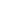

# Toggl Import

Import Toggl Track time entries into your Obsidian daily notes with a single command.

The active note's filename (yyyy-mm-dd) determines the date, entries are fetched from
Toggl's API, and the formatted output is inserted at the cursor — no manual copying.



**Features:**

- Three output formats: Markdown table, plain text (configurable delimiter), or custom
  template (`$description`, `$start`, `$duration`, `$tags`, `$project` placeholders)
- Configurable columns: Description, Start time, Duration, Tags, Project
- Sort entries by start time (ascending or descending)
- Secure API token storage — device-local, not synced via Obsidian Sync
- Test connection button to verify your API token before importing

## Manual Installation

1. Download `main.js` and `manifest.json` from the
   [latest release](https://github.com/theaspect/obsidian-toggl-import/releases/latest)
   on GitHub.
2. Create the folder `<vault>/.obsidian/plugins/obsidian-toggl-import/` if it does not
   already exist.
3. Copy `main.js` and `manifest.json` into that folder.
4. Open Obsidian **Settings > Community plugins**, scroll to the plugin list, and enable
   **Toggl Import**.

## Install via BRAT

[BRAT](https://github.com/TfTHacker/obsidian42-brat) lets you install pre-release plugins
directly from a GitHub repository.

1. Install the [BRAT](https://github.com/TfTHacker/obsidian42-brat) plugin from the
   Obsidian Community plugins list.
2. In BRAT settings, click **Add Beta Plugin**.
3. Paste `theaspect/obsidian-toggl-import` and confirm.
4. Open **Settings > Community plugins** and enable **Toggl Import**.

## Usage

1. Open **Settings > Toggl Import**, paste your Toggl API token (found at
   [track.toggl.com/profile](https://track.toggl.com/profile) under "API Token"), then
   click **Test** to verify the connection.
2. Open (or create) a daily note whose filename starts with a date in `yyyy-mm-dd` format
   — e.g. `2026-04-16.md` or `2026-04-16 Wednesday.md`.
3. Place your cursor where you want the entries inserted.
4. Open the command palette (**Ctrl/Cmd+P**) and run **Toggl Import: Import Toggl Entries**.
5. Time entries for that date appear at the cursor position, formatted according to your
   settings.

Running the command again appends new entries rather than replacing existing ones.

## Settings

| Setting | Description | Default |
|---------|-------------|---------|
| Toggl API token | Your Toggl Track API token, stored locally on this device | (empty) |
| Test connection | Verify the token by calling the Toggl `/me` endpoint | — |
| Output format | `Markdown table`, `Plain text`, or `Custom template` | Markdown table |
| Delimiter | Column separator used in plain text mode | `\|` |
| Template | Template string for custom template mode. Available variables: `$description`, `$start`, `$duration`, `$tags`, `$project` | `$description ($duration)` |
| Sort order | `Ascending` (oldest first) or `Descending` (newest first) | Ascending |
| Columns | Toggle individual columns: Description, Start time, Duration, Tags, Project. Disabled in template mode (template controls output). | Description, Start time, Duration enabled |

## Development

```
git clone https://github.com/theaspect/obsidian-toggl-import.git
cd obsidian-toggl-import
npm install
npm run dev      # watch mode — rebuilds on every file save
npm run build    # type-check + production bundle
npm test         # run tests
```

Copy `main.js` and `manifest.json` to your vault's plugin folder
(`<vault>/.obsidian/plugins/obsidian-toggl-import/`) for manual testing. The
[Hot-Reload](https://github.com/pjeby/hot-reload) community plugin auto-reloads the
plugin whenever `main.js` changes — no Obsidian restart needed.

## License

[MIT](LICENSE)
